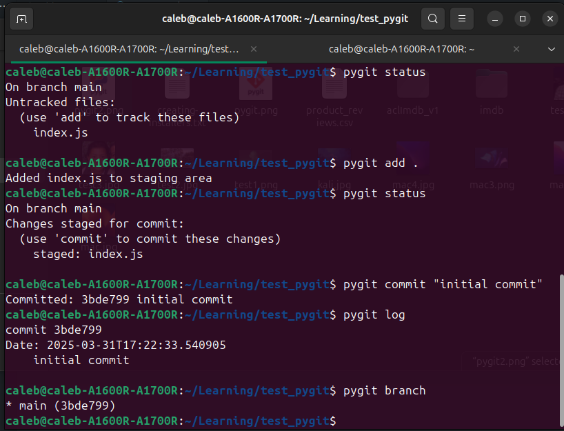
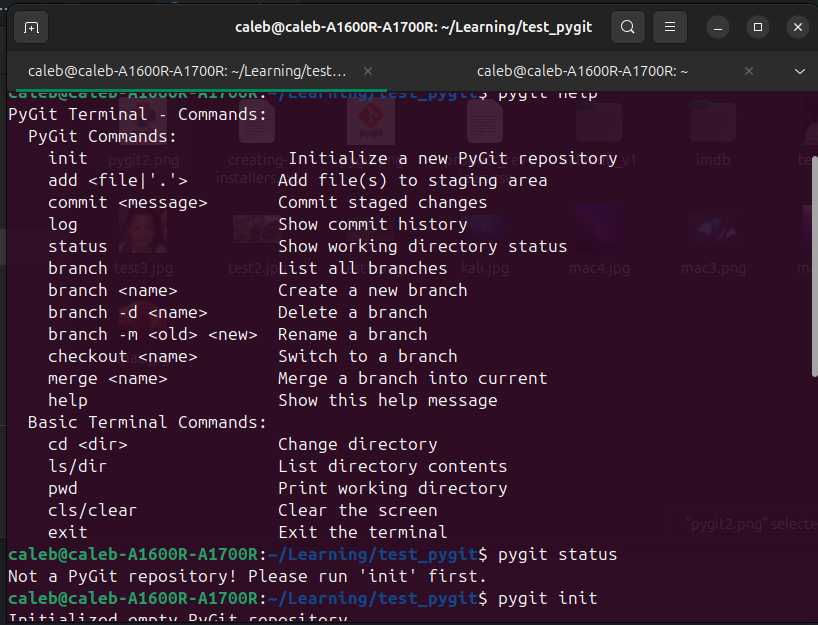
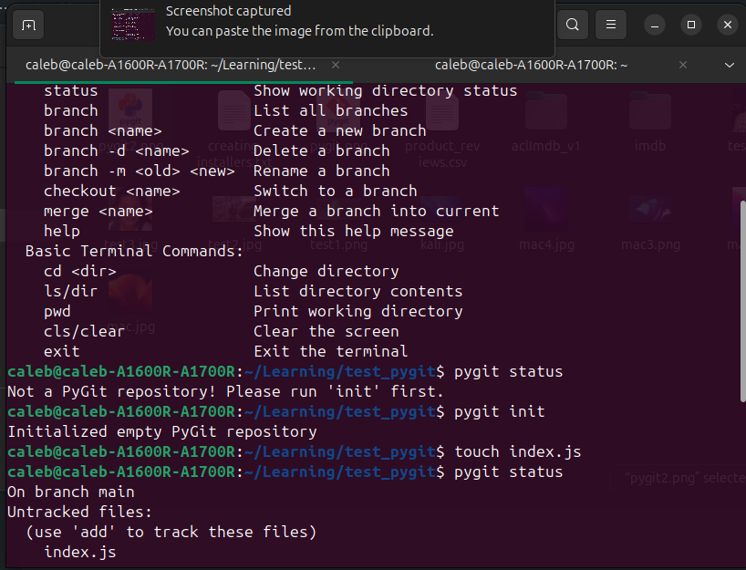
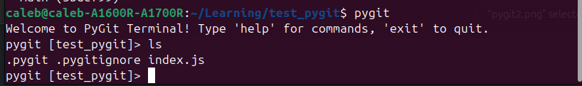

Pygit Version Control system(GIT INSPIRED || Made in Python for learning purposes by Kwizera Caleb)

# PyGit Commands

## PyGit Commands

- **`pygit init`**: Initialize a new PyGit repository.
- **`pygit add <file|'.'>`**: Add file(s) to the staging area.
- **`pygit commit <message>`**: Commit staged changes with a message.
- **`pygit log`**: Show commit history.
- **`pygit status`**: Show working directory status.
- **`pygit branch`**: List all branches.
- **`pygit branch <name>`**: Create a new branch.
- **`pygit branch -d <name>`**: Delete a branch.
- **`pygit branch -m <old> <new>`**: Rename a branch.
- **`pygit checkout <name>`**: Switch to a branch.
- **`pygit merge <name>`**: Merge a branch into the current branch.
- **`pygit help`**: Show help message.

## Basic Terminal Commands

- **`cd <dir>`**: Change directory.
- **`ls/dir`**: List directory contents.
- **`pwd`**: Print working directory.
- **`cls/clear`**: Clear the screen.
- **`exit`**: Exit the terminal.

